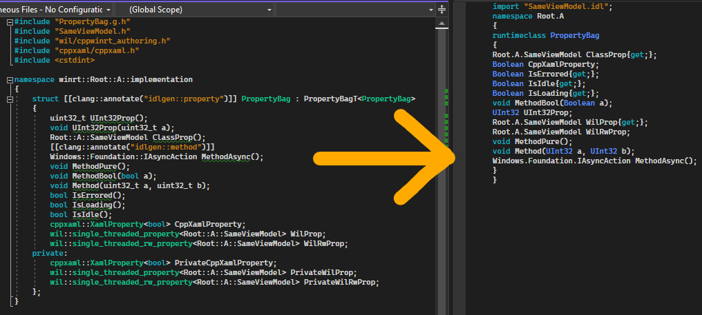

# idlgen, an IDL Generator for WinRT

[](https://www.nuget.org/packages/IdlGen.IdlGen.Cpp/)
[)](https://marketplace.visualstudio.com/items?itemName=Roxk.idlgencpp)
[](https://github.com/roxk/idlgen/actions/workflows/ci.yaml)

A library for generating idl files when implementing WinRT components. Currently, only C++ is supported.



## Installation

### Nuget

Use your preferred way (cli/GUI) to install nuget package `IdlGen.IdlGen.Cpp`, which can be found on [nuget gallery](https://www.nuget.org/packages/IdlGen.IdlGen.Cpp/).

### IDE Extension

- [IdlgenCpp for Visual Studio 2022](https://marketplace.visualstudio.com/items?itemName=Roxk.idlgencpp)

On top of the nuget package, you can also install IDE extension to streamline the code generation process. The extension provides the following command:
- "Generate IDL" in header file context menu

**Note**: The above nuget package is required for the extension to work. Please install it in all of your project in which you wish to generate IDL.

## Usage (C++)

1. Make sure your project can compile and build.
2. Add `pch.h` and `idlgen.h`, and other necessary includes in the header of your implementation type.
3. Edit a header file of your implementation type.
4. Build the project. A custom build step would run before compilation.
5. Viola! The idl file of the implementation type has been generated.

The library would generate the whole runtimm class definition for you. There should be literally zero edit you need to make on the resultant idl file.

### Automatically Generated Structures

The library could automatically generate the following structures in an ordinary idl files:
- Runtime class definition, if an implementation type is found
- All (static) methods
- All (static) events
- Import for supported entities in another header file. Supported entities include
	- Implementation type. Suppose `A.h` includes `B.h`, and `B.h` contains the definition of the implementation type of `B`. Any reference to `B` in `A.h` (projected or implementation), would cause `A.idl` to import `B.idl`
	- Authored type. See [Struct, Delegate, Enum](#Struct-Delegate-Enum)

Additionally, idlgen could generate the following with the use of some tag types or configured templates:
- Runtime class base
- Properties
- Struct
- Enum
- Delegate

#### Base

To specify the base type and interface for a runtime class, the class should inherit from `idlgen::base` tag template. For example, to inherit from `Page` and implement `INotifyPropertyChanged`, a runtime class should inherit `idlgen::base<Windows::UI::Xaml::Controls::Page, Windows::UI::Xaml::Data::INotifyPropertyChanged>`.

#### Property

Template types that has a single template parameter and overloads `operator()` can be configured as getter or property templates. When a (static) data member is defined with these types, idlgen would recognize these overloaded `operator()` as runtime class methods. When configured, these methods would be considered as getter or setter (property).

To specify a template type as getter, add the qualified name of the template to project property `IdlGenCppGetterTemplate`.

To specify a template types as property, add the qualified name of the template to project property `IdlGenCppPropertyTemplate`.

See [property.md](property.md) for more details. For ordinary properties with `T Property()` or `void Property(T)` signature, see [Structures Requiring Special Author Help](#Structures-Requiring-Special-Author-Help)

#### Event

Template types that overloads `operator()` with return type and parameters matching event revoker/registrar are recognized as event automatically.

#### Struct, Delegate, Enum

To generate these structures, define the structure in C++ and inherit the correct tag type according to the following table.

Make sure they are defined in `implementation` namespace to avoid name collision with the generated projected types.

Types which inherit the following tag types are called authored types (similar to how implementation of runtime class are called implemenation types).

|Structure|Tag type|Note|Example|Result|
|--|--|--|--|--|
|struct|`idlgen::author_struct`|N/A|`struct Point : idlgen::author_struct { int32_t X; int32_t Y; }`|`struct Pointer { Int32 X; Int32 Y;}`|
|delegate|`idlgen::author_delegate`|Overload `operator()`|`struct Handler : idlgen::author_delegate { void operator()(int32_t a, int32_t b);}`|`delegate void Handler(Int32 a, Int32 b)`|
|enum|`idlgen::author_enum`|Must be scoped enum|`enum class State : idlgen::author_enum {A, B}`|`enum State {A, B}`|
|enum flags|`idlgen::author_enum_flags`|Must be scoped enum|`enum class State : idlgen::author_enum_flags {A = 0x1, B = 0x2}`|`[flags] enum State {A = 0x1, B = 0x2}`|
|interface|`idlgen::author_interface`|N/A|`struct Interface : idlgen::author_interface { void Method(); }`|`interface Interface { void Method(); }`|

### Structures Requiring Special Author Help

1. Attributes
2. Properties defined without configured getter or property templates
3. Import file of projected types, non-authored types referenced in the runtime class

The above structures require the help of class author to generate. The library defined a set of custom attributes, which, when declared on a class or methods, would allow the library to generate the missing pieces.

Please see [Idlgen Custom Attributes](#Idlgen-Custom-Attributes) for more details.

### Idlgen Custom Attributes

The syntax for idlgen's custom attributes is
```
[[clang::annotate("idlgen::$attribute=$args")]]
```

The library currently utilize clang's annotate attribute to specify an inner attribute, following C++'s `namespace::attribute(args)` convention. `=` is used instead of `()` to simplify parsing.

Below is a table for all attributes and their usage.

|Attribute|Args|Description|Applicable On|Example Declaration|Resultant idl|
|--|--|--|--|--|--|
|`import`|`value,value,...`|Add import statement(s)|class|`[[clang::annotate("idlgen::import=A.idl,B.idl"]]`|`import "A.idl";import "B.idl";`|
|`attribute`|`value`|Add an attribute|class|`[[clang::annotate("idlgen::attribute=default_interface")]]`|`[default_interface]`|
|`property`|N/A|The method is a property|method|`[[clang::annotate("idlgen::property")]]`||
|`hide`|N/A|Hide class or methods|class/method|`[[clang::annotate("idlgen::hide")]]`||

*Note*: By default, the tool would generate `[default_interface]` attribute for an empty class (a class that doesn't have any methods other than constructor) so you don't need to add it.

## Tips

### Common Header Modification

|What to achieve in IDL|What to do in header|
|--|--|
|Hide public event handler in XAML|Make the handler private, then add `friend struct ClassT<Class>`|
|Hide public event handler for any other runtime class|Make the handler private, then add `friend ClassT<Class>`|
|Hide public overriden methods|Use `[[clang::annotate("hide")]]` on the method|

Note: The friend syntax is different because for XAML `ClassT` is a struct, for any other runtime class it is an alias template.

### Generate IDL for Only One Header

Run `msbuild -target:IdlGenCppGenerateIDL -p:IdlGenCppInclude=MyClass.h -p:IdlGenCppExclude="" -p:Platform=x64`.

If you have the extension installed, right click on the header file and click "Generate IDL".

## Project Property

|Name|Description|
|--|--|
|`IdlGenCppGenerateIDL`|Master control to configure whether idl files are generated|
|`IdlGenCppInclude`|Control which and only files to include|
|`IdlGenCppExclude`|Exclude the files from generating idl|
|`IdlGenCppDisableUnknownAttributeWarning`|Disable unknown attribute warning|
|`IdlGenCppPch`|Pch files. Used to speed up generation|
|`IdlGenCppGetterTemplate`|Template types of data member which should be generated as getter|
|`IdlGenCppPropertyTemplate`|Template types of data member which should be generated as property|
|`IdlGenCppAdditionalDefines`|Additional prepropcessor definitions. Used to define e.g. `NOMINMAX`|

## Troubleshooting

#### The library failed to generate idl file for my implementation type

The tool needs to parse the header file as if it's compiling it, so _all_ necessary headers have to be included. Make sure you add all necessary includes in the header file. It's suggested that you add `pch.h` to all header files to ease include effort. There should be no additional compilation penalty.

#### I made a mistake in the header file, and the library generated an idl file that cannot be compiled! Now the project is stuck at failing to build idl and cannot re-generate the idl from header

Relax. There are two solutions. 

1. Fix your header file. Then, run the command in [Generate IDL for Only One Header](#Generate-IDL-for-Only-One-Header) on the header.

2. Copy the old content from `.idl.bak` generated by the library so that the build system can finish the idl building phase. Next, fix your header file. Build the project again after you have fixed the header file.

If you are in the heat of refactoring a class in a header file and do not want the tool to generate idl at all, you can add the header file to project property `IdlGenCppExclude`, either manually or via VS's project property page.

## Incremental Adoption in Existing Codebase

In a large code base, it is difficult to edit all existing header files to make them generate correct idl at once. It is suggested that large code base strictly follows the edit-one-header-at-a-time workflow to avoid generating a bunch of invalid idl files which stop the project from building.

Follow these steps to configure the project for an edit-one-header-at-a-time workflow:
1. Set `IdlGenCppGenerateIDL` to true.
2. Set `IdlGenCppExclude` to `**/*.h` to exclude all headers by default.
3. Follow the instruction in [Generate IDL for Only One Header](#Generate-IDL-for-Only-One-Header) to generate only one header file at at time. It's highly recommended that you use the VS extension which has the convenient "Generate IDL" context menu command.

## CI Consideration

Since idl files are meant to be included in the source, there is no need to generate these idl files in CI (Continuous Integration). The library provide an option to control generating idl files (`IdlGenCppGenerateIDL` for C++). Make sure you set this property to `false` in CI.

## Dev (Inner) Loop Consideration

Just follow the advice in [Incremental Adoption in Existing Codebase](#Incremental-Adoption-in-Existing-Codebase).

## Contribution

Contributions are welcome! If you found a bug, please file a bug report.

For more details, such as build instruction, please see [Contribution.md](Contribution.md).
