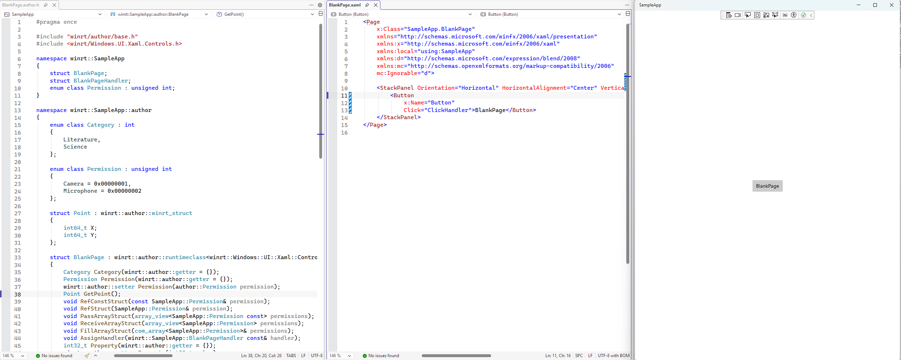

# idlgen, write C++/WinRT apps without idl

[](https://www.nuget.org/packages/IdlGen.IdlGen.Cpp/)
[](https://github.com/roxk/idlgen/actions/workflows/ci.yaml)

Write C++, F5, and see your C++/WinRT app running. Git-ignore idl in your codebase.



idlgen is a C\+\+20 library that helps you get rid of idl and implementation type while authoring C++/WinRT types, with the aim of bringing the developer experience on par with C++/CX (regardless of XAML).

## Pre-requisite

- C++20 (the library uses concept and string-as-NTTP)

## Installation

### Nuget

1. Use your preferred way (cli/GUI) to install nuget package `IdlGen.IdlGen.Cpp`, which can be found on [nuget gallery](https://www.nuget.org/packages/IdlGen.IdlGen.Cpp/).
2. Add `#undef GetCurrentTime` after your `#include <unknwn.h>` and `#include <windows.h>`

## Usage

1. Add `<winrt/Windows.Foundation.h>` to pch.h*
2. Add `<idlgen.impl.h>` to pch.h
2. In your pch.h, only include existing implementation type header if `IDLGEN_CPP_STATIC_REFLECTION_PHASE` is NOT defined. i.e. add this block to your pch.h:
```
#ifndef IDLGEN_CPP_STATIC_REFLECTION_PHASE
#include "MyExistingIdlType.h"              // They cannot be included during reflection phase since .g.h is not generated yet
#endif
```
3. Viola! Start writing authored type following rules below

*If you do not want to do that, make sure anywhere you write author type you must include `<winrt/Windows.Foundation.h>`. If you do not include it in pch, and have not written any author type yet, disable generating idl via project property `IdlGenCppGenerateIDL`. 

### Rules Pre-requisite

- C++/WinRT terminology

### Cheatsheet

For a "I want to do X, what do I write" kind of cheatsheet, see [here](./Cheatsheet.md).

### Rules

Idlgen allows you to write _authored types_. You never write idl nor implementation type directly. These are generated by idlgen.

To aid generation, you have to follow some rules:

1. WinRT concepts that can be 100% expressed in C++ is expressed using C++. E.g. declaring an enum.
2. You must declare your type in `author` namespace. Only typse in `author` namespace are authored types (idlgen would trim `author` and `winrt` in the final idl)
3. Your authored type must live inside header and must not contain any function definition. Function definition goes to cpp files. 
4. Authored type can only reference projected types, or, in some cases, other authored types (see below). 
5. Projected types from upstream dependencies can be referenced directly.
6. Projected types of authored types must be forward declared.
7. Only in the following scenarios authored types are allowed to be referenced by an authored type:
   a. Inherit an authored interface
   b. Using authored value types (struct/enum) _directly_. Using value types with reference, or in array is NOT using them directly.

For all other cases, authored type should forward declare relevant projected types, regardless of whether it's a struct, enum, delgate, and so on.

That's it. That's all the rules.

**Note**: To speed up generation, idlgen does little to no check on whether what you write is correct. Most errors will only surface as idl error. 

### Example: Author a runtime class

```
#include <winrt/author/base.h>
#include <winrt/Microsoft.UI.Xaml.Data.h>
#include <winrt/Microsoft.UI.Xaml.Controls.h>
namespace winrt::MyNamespace::author
{
	struct IMyInterface : winrt::author::winrt_interface
	{
	};
	struct MyType : winrt::author::runtimeclass<
		winrt::Microsoft::UI::Xaml::Controls::Page, 
		winrt::Microsoft::UI::Xaml::Data::INotifyPropertyChanged
	>, IMyInterface
	{
		int Property(winrt::author::getter = {});
		winrt::author::setter Property(int value);
		winrt::event_token PropertyChanged(Microsoft.UI.Xaml.Data.PropertyChangedEventHandled const& handler);
		void PropertyChanged(winrt::event_token token);
		void AuthoredTypeSpecificMethod(winrt::author::ignore = {});
	};
}
```

The above snippet declare a runtime class `MyType` and a WinRT interface `IMyInterface` in namespace `MyNamespace`. `MyType` extends `Microsoft.UI.Xaml.Controls.Page`. `MyType` has a property `Property`, and an event `PropertyChanged`. It also has a method that is only meant to be called by other authored types `AuthoredTypeSpecificMethod()` (note the `winrt::author::ignore` parameter is defaulted).

Idlgen uses marker types to identify whether your authored types are runtimeclass, or struct, or enum. Other times, idlgen needs to know extra information about a WinRT entity (whehter a method denotes a getter, etc). Below are the rule-of-thumb of how to use marker types:

- To declare an WinRT entity, inherit a marker type
- To express WinRT-only concepts, place a marker type in a method parameter

For more details, see the table below:

### Marker Type Table

|Fully qualified name|Usage|Where to use|Note|
|--|--|--|--|
|`winrt::author::runtimeclass`|Declare a runtime class, specify base class and _projected_ interface|base|Empty template argument is allowed|
|`winrt::auther::winrt_interface`|Declare an interface|base|To require an authored interface, simply inherit it|
|`winrt::author::winrt_struct`|Declare a struct|base||
|`winrt::author::delegate`|Declare a delegate|base|Use constructor to specify parameters (return type is always void)|
|`winrt::author::attribute`|Declare an attribute|base|There is no way to apply an attribute declared in other idl yet|
|`winrt::author::getter`|Declare this function is a getter|function parameter|Always specify a default value via `= {}`|
|`winrt::author::setter`|Declare this function is a setter|return type of function||
|`winrt::author::unsealed`|Declare this class is unsealed|base||
|`winrt::author::static_class`|Declare this class is static class|base||
|`winrt::author::partial`|Declare this class is partial|base||
|`winrt::author::ignore`|Declare this entity is ignored in idl|function parameter|Always specify a default value via `= {}`|
|`winrt::author::apply_attr`|Apply attr to an entity|base|1st template argument is the attribute. 2nd+ are attribute parameters|
|`winrt::author::attr_string`|Specify a string attirubte parameter|`apply_attr` 's template arguments||
|`winrt::author::attr_type`|Specify a type attribute parameter|`apply_attr` 's template arguments||
|`winrt::author::contentproperty` and friends|Built-in attributes in idl|`apply_attr` 's 1st template argument||

### Visibility

Only public, protected* members are reflected. Private members are never reflected. If you have member functions that should be pubic but not included in idl, add `wirnt::author::ignore = {}` in the parameter.

*Protected members are only declared as protected in idl if the runtime class is `unsealed`. Otherwise, it's ignore in idl.

### Notes

1. To implement an authored interface, simply inherit it
2. To declare enum or `[flags]` enum, simply declare enum classes with `int` and `unsigned` as the underlying types respectively.
3. When value types are passed by values in functions, it's not possible to forward declare them. Therefore, authored value types (struct/enum) as stated in rule (7) can be passed as-is. If you only need to pass authored value type reference/array of value type around, you should forward declare their projected types and pass around their projected types instead.

## Contribution

Contributions are welcome! If you found a bug, please file a bug report.

For more details, such as build instruction, please see [Contribution.md](Contribution.md).

## How It Works

Idlgen is powered by C++26 static reflection and constexpr code generation. Before compiling midl, a program written in C\+\+26 would reference all of your authored types and reflect them. The output of the reflection is some idl and implementation type files, which are then picked up by custom build tasks and include them as Midl, ClInclude, and ClCompile targets.

## Limitation

1. Authored type must define all of their methods in .cpp files, due to [bootstrapping](#Bootstrapping-idlgen).
2. To speed up generation, idlgen does little to no check on whether what you write is correct. Most errors will only surface as idl error.
3. Since static reflection is currently only supported in gcc, the library actually ships a complete gcc toolchain, which adds significantly to nuget size.
4. We have to pay pch.h compilation penalty twice (once in msvc, once in gcc). This and the above limitation can be removed once MVSC supports static reflection and all required constexpr machinary.

### XAML Related Limitation

XAML Compiler can NOT work with header file that doesn't have ordinary `.h` extension. Do NOT in order to setup `IdlGenCppInclude=*.author.h` change extension to e.g.`.author.h`. If you want to use wildcard, you can put all your authored type in a specific folder and specify `IdlGenCppInclude=author\*.h`.

## Generate IDL for Only One Header

Specify `MyClass.h` in VS -> right click project -> Properties -> Idlgen -> Include. Or, in cli: `msbuild -target:IdlGenCppGenerateIDL -p:IdlGenCppInclude=MyClass.h -p:IdlGenCppExclude="" -p:Platform=x64`.

## Project Property

|Name|Description|
|--|--|
|`IdlGenCppGenerateIDL`|Master control to configure whether idl files are generated|
|`IdlGenCppInclude`|Control which and only files to include|
|`IdlGenCppExclude`|Exclude the files from generating idl|
|`IdlGenCppPch`|Pch files. Used to speed up generation. Only 1 pch file is supported|

## Something isn't working!

Idlgen ouputs build logs to Output -> Build window. Look at what is failing and see if you need a rebuild. Remove `pch.h.gch`, clean the resolution, and rebuild usually fixes it. Please file a bug report if you have minimal reproducible steps, thank you!

## Incremental Adoption in Existing Codebase

1. Know that your existing idl can coexist with idlgen, by simply not touching the relevant .idl and .h files.
2. Make use of `IdlGenCppInclude` and `IdlGenCppInclude` to selectively include new authored type files
3. Migrate old idl + .h files to author types one by one. Remove existing idl if it has been migrated.
4. Note that your author types can NOT reference any other implementation type as per the rules. Therefore, it's best if you convert your leaf types to author types first.

## CI/CD Consideration

Files generated by idlgen are NOT supposed to be checked in to version control. Do NOT `git add` files in the Generated Files folder.

## "Bootstrapping" idlgen

Generating idl from C++ actually involves the classic chicken and egg problem. To generate idl, a header file needs to be compiled. To compile the header file, _some_ C++/WinRT projection need to exist. To generate C++/WinRT projection, winmd and thus idl files are required.

Other languages (C#, cppfront) solve this by multi-phase compilation. Essentially, a symbol can be defined after its use. These symbols include symbols in type annoation, method names, and so on. 

C++ does not have this luxury. The best C++ have is forward declared entity. And that's about it. We can forward declare the existence of a type, but we cannot forward declare what methods it have. The result is the current design of idlgen: we can forward-delcare projected type, but we cannot reference them in our function body in header files as any projected type's method call would cause a hard undefined symbol error during static reflection.

Careful readers would notice there is a loophole in this no-function-definition-in-authored-type rule. That is, as long as the function body does NOT reference anything that cannot be forward-declared for a projected authored type, you can write your function body in header file just fine. It's just that this is not really teachable. So, the more advanced version of this rule is actually: "Your authored type must live inside header and must not reference any forward-declared projected type's method". Note that authored type's method is also prohibited as implied by rule (4).

TLDR: Idlgen solves this problem by setting up rules about what authored types can reference. See [usage](#Usage).
