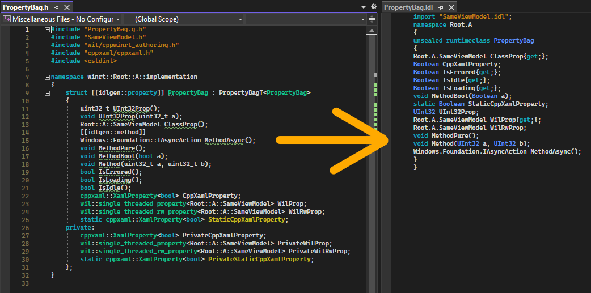

# idlgen, an IDL Generator for WinRT

[)](https://marketplace.visualstudio.com/items?itemName=Roxk.idlgencpp)

_idl-free_ C++/WinRT is here.

Idlgen is a library for generating idl files when implementing WinRT components. With this library, you never have to write a single line of MIDL3 again.

Currently, only C++ is supported.

## Installation

### Nuget

Use your preferred way (cli/GUI) to install nuget package `IdlGen.IdlGen.Cpp`, which can be found on [nuget gallery](https://www.nuget.org/packages/IdlGen.IdlGen.Cpp/).

### IDE Extension

- [IdlgenCpp for Visual Studio 2022](https://marketplace.visualstudio.com/items?itemName=Roxk.idlgencpp)

On top of the nuget package, you can also install IDE extension to streamline the code generation process. The extension provides a convenient "Generate IDL" command in a context menu. If you want to adopt idlgen incrementally in an existing code base, this extension is a must-have.

**Note**: The above nuget package is required for the extension to work. Please install it in all of your project in which you wish to generate IDL.

## Usage (C++)

1. Add a new runtime class (view model or XAML page) from C++/WinRT template. Or, you can start with existing runtime classes.
2. Add `pch.h` and `idlgen.h`, and other necessary includes in the header of your implementation type.
3. Edit the header file. E.g. add a method.
4. Build the project. A custom build step that generates idl files would run before `Midl`.
5. Viola! The idl file of the implementation type has been updated. `Midl` would then update/generate a `winmd` with the modification, and C++/WinRT would pick it up when generating projection.
6. Made a mistake in header, e.g. forgot to add an import? No worries! Just edit your header and rebuild. Idlgen would pick up your changes and proceed to generate an updated idl. It just works™️.

The library would generate the whole runtimm class definition for you. There should be literally zero edit you need to make on the resultant idl file.

### Automatically Generated Structures

The library could automatically generate the following structures in an ordinary idl files:
- Runtime class definition, if an implementation type is found
- All (static) methods
- All (static) events
- Import for supported entities in another header file. Supported entities include
	- Implementation type. Suppose `A.h` includes `B.h`, and `B.h` contains the definition of the implementation type of `B`. Any reference to `B` in `A.h` (projected or implementation), would cause `A.idl` to import `B.idl`
	- Authored type. See [Struct, Delegate, Enum](#Struct-Delegate-Enum)

Additionally, idlgen could generate the following with the use of some tag types or configured templates:
- Runtime class base
- Properties
- Struct
- Enum
- Delegate

#### Base

To specify the base type and interface for a runtime class, the class should inherit from `idlgen::base` tag template. For example, to inherit from `Page` and implement `INotifyPropertyChanged`, a runtime class should inherit `idlgen::base<Windows::UI::Xaml::Controls::Page, Windows::UI::Xaml::Data::INotifyPropertyChanged>`.

#### Property

Template types that has a single template parameter and overloads `operator()` can be configured as getter or property templates. When a (static) data member is defined with these types, idlgen would recognize these overloaded `operator()` as runtime class methods. When configured, these methods would be considered as getter or setter (property).

To specify a template type as getter, add the qualified name of the template to project property `IdlGenCppGetterTemplate`.

To specify a template types as property, add the qualified name of the template to project property `IdlGenCppPropertyTemplate`.

See [property.md](property.md) for more details. For ordinary properties with `T Property()` or `void Property(T)` signature, see [Structures Requiring Special Author Help](#Structures-Requiring-Special-Author-Help)

#### Event

Template types that overloads `operator()` with return type and parameters matching event revoker/registrar are recognized as event automatically.

#### Struct, Delegate, Enum

To generate these structures, define the structure in C++ and inherit the correct tag type according to the following table.

To prevent name collision between projected type and its authored types, you can prefix type name with `_` to prevent name collision. Idlgen would trim `_` out of type names in idl. 

Types which inherit the following tag types are called authored types (similar to how implementation of runtime class are called implemenation types).

|Structure|Tag type|Note|Example|Result|
|--|--|--|--|--|
|struct|`idlgen::author_struct`|N/A|`struct _Point : idlgen::author_struct { int32_t X; int32_t Y; }`|`struct Pointer { Int32 X; Int32 Y;}`|
|delegate|`idlgen::author_delegate`|Overload `operator()`|`struct _Handler : idlgen::author_delegate { void operator()(int32_t a, int32_t b);}`|`delegate void Handler(Int32 a, Int32 b)`|
|enum|`idlgen::author_enum`|Must be scoped enum|`enum class _State : idlgen::author_enum {A, B}`|`enum State {A, B}`|
|enum flags|`idlgen::author_enum_flags`|Must be scoped enum|`enum class _State : idlgen::author_enum_flags {A = 0x1, B = 0x2}`|`[flags] enum State {A = 0x1, B = 0x2}`|
|interface|`idlgen::author_interface`|N/A|`struct _Interface : idlgen::author_interface { void Method(); }`|`interface Interface { void Method(); }`|

### Structures Requiring Special Author Help

1. Attributes
2. Properties defined without configured getter or property templates
3. Import file of projected types, non-authored types referenced in the runtime class

The above structures require the help of class author to generate. The library defined a set of custom attributes, which, when declared on a class or methods, would allow the library to generate specified structures.

Please see [Idlgen Custom Attributes](#Idlgen-Custom-Attributes) for more details.

### Visibility

By default, all generated methods/properties are public. To generate protected methods/properties, make them protected in C++. Alternatively, you can use attribute to specify a declaration should be protected.

### Overridable

By default, all generated methods/properties are not overridable. To generate overridable methods/properties, make them virtual in C++. For getter/property templates (static) data members, you have to use attribute to specify a declaration should be overridable.

### Idlgen Custom Attributes

The syntax for idlgen's custom attributes is ordinary C++ attributes, with `idlgen` being the namespace.

Below is a table for all attributes and their usage.

|Attribute|Args|Description|Applicable On|Example Declaration|Resultant idl|
|--|--|--|--|--|--|
|`import`|`"value",...`|Add import statement(s)|class|`[[idlgen::import("A.idl","B.idl")]]`|`import "A.idl";import "B.idl";`|
|`attribute`|`"value",...`|Add an attribute|class|`[[idlgen::attribute("webhosthidden", "bindable")]]`|`[default_interface][webhosthidden]`|
|`property`|N/A|The method is a property/All applicable methods in a class are properties|class/method|`[[idlgen::property]]`||
|`method`|N/A|The method is a method/All methods in a class are methods|class/method|`[[idlgen::method]]`||
|`hide`|N/A|Hide class or methods or data member|class/method/data member|`[[idlgen::hide]]`||
|`overridable`|N/A|Make a method/property overridable|method|`[[idlgen::overridable]]`||
|`protected`|N/A|Make a method protected|method|`[[idlgen::protected]]`||
|`sealed`|N/A|Make a runtimeclass sealed|class|`[[idlgen::sealed]]`||

*Note*: By default, the tool would generate `[default_interface]` attribute for an empty class (a class that doesn't have any methods other than constructor) so you don't need to add it.

## Limitation

Due to [bootstrapping](#Bootstrapping-idlgen), Idlgen currently has the following limitation:

1. Authored WinRT projected types must be treated as incomplete types in headers. That is, you can only refer to the name of the type as if it is forward declared. This limitation applies to all projected types, including runtime class, enum, etc. In practice, this means method definitions which use projected types must be defined in .cpp files.

   - If you are using visual studio, you can right click affected method and choose "Move definition location" to automatically fix it.

## Tips

### Common Header Modification

|What to achieve in IDL|What to do in header|
|--|--|
|Hide public event handler in XAML|Make the handler private, then add `friend struct ClassT<Class>`|
|Hide public event handler for any other runtime class (See note)|Make the handler private, then add `friend ClassT<Class>`|
|Hide public overriden methods|Use `[[idlgen::hide]]` on the method|
|Make a class' applicable methods properties by default|Use `[[idlgen::property]]` on the class|
|Make methods protected|Declare them in `protected:` block|
|Make `wil::single_threaded_rw_property<bool> Prop` overridable|Use `[[idlgen::overridable]]` on the property|

Note: The friend syntax is different because for XAML `ClassT` is a struct, for any other runtime class it is an alias template.

### Generate IDL for Only One Header

Run `msbuild -target:IdlGenCppGenerateIDL -p:IdlGenCppInclude=MyClass.h -p:IdlGenCppExclude="" -p:Platform=x64`.

If you have the extension installed, right click on the header file and click "Generate IDL".

## Project Property

|Name|Description|
|--|--|
|`IdlGenCppGenerateIDL`|Master control to configure whether idl files are generated|
|`IdlGenCppInclude`|Control which and only files to include|
|`IdlGenCppExclude`|Exclude the files from generating idl|
|`IdlGenCppDisableUnknownAttributeWarning`|Disable unknown attribute warning|
|`IdlGenCppPch`|Pch files. Used to speed up generation|
|`IdlGenCppGetterTemplate`|Template types of data member which should be generated as getter|
|`IdlGenCppPropertyTemplate`|Template types of data member which should be generated as property|
|`IdlGenCppAdditionalDefines`|Additional prepropcessor definitions. Used to define e.g. `NOMINMAX`|

## Troubleshooting

#### Something isn't working!

Idlgen ouputs build logs to Output -> Build window. Look at what is failing and see if you need a rebuild, or encountered any of the following issues.

#### Idlgen complains some include(s) is missing

Idlgen needs to parse WinRT projection header files and other headers as if it's compiling your header, so make sure you have included _all_ necessary headers. It's suggested that you add `pch.h` to all header files to ease include effort.

#### I made a mistake in the header file, and idlgen generated an idl file that cannot be compiled!

Fix your header and rebuild, and idlgen would re-generate the idl. It should just work™️. If it doesn't, please file a bug.

*How it works*: Idlgen runs a bootstrap pass before IDL generation so malformed idl doesn't cause problems. If for some reason [bootstrapping](#Bootstrapping-idlgen) doesn't work, you can revert your edit to header (assuming the old header + idl was compilable), build once, and edit again. Please also file a bug.

## Incremental Adoption in Existing Codebase

In a large code base, it is difficult to edit all existing header files to make them generate correct idl at once. It is suggested that large code base strictly follows the edit-one-header-at-a-time workflow to avoid generating a bunch of invalid idl files which stop the project from building.

Follow these steps to configure the project for an edit-one-header-at-a-time workflow:
1. Set `IdlGenCppGenerateIDL` to true.
2. Set `IdlGenCppExclude` to `**/*.h` to exclude all headers by default.
3. Follow the instruction in [Generate IDL for Only One Header](#Generate-IDL-for-Only-One-Header) to generate only one header file at at time. It's highly recommended that you use the VS extension which has the convenient "Generate IDL" context menu command.

## CI Consideration

Since idl files are meant to be included in the source, there is no need to generate these idl files in CI (Continuous Integration). The library provide an option to control generating idl files (`IdlGenCppGenerateIDL` for C++). Make sure you set this property to `false` in CI.

## Dev (Inner) Loop Consideration

Just follow the advice in [Incremental Adoption in Existing Codebase](#Incremental-Adoption-in-Existing-Codebase).

## Design Principles

1. This library *conceptually depend*\* on only C++/WinRT. All types/names/concepts/whatever not defined by C++/WinRT but required for a feature should be configurable.
2. Use tag types in the language (currently, C++ only) whenever possible. This aligns with the design of cppwinrt, and has type safety in certain sceneario (e.g. for specifying bsse type). Only use attribute when it has to (e.g. hide/property).

\**Conceptual dependence* (or logical dependence) means depending on the API or even implementation details of a library when implementing the logic of genrating idl. For example, this library depends on the existence `winrt::event_token` (i.e. the type is hard coded) in C++/WinRT to generate event, but does not depend on `wil` to generate property. `wil::*` are expected to be configured as getter/property templates in project properties instead. The implementation of this library, however, is free to take a dependency on wil (e.g. installing the nuget). 

## "Bootstrapping" idlgen

Idl generation from C++ actually involves the classic chicken and egg problem. To generate idl, a header file needs to be compiled. To compile the header file, C++/WinRT projection need to exist. To generate C++/WinRT projection, winmd and thus idl files are required.

Idlgen solves this problem by inserting a "bootstrap" build step before generating idl. During bootstrapping, idlgen would generate dummy idls and forces C++/WinRT to generate projection. Said projection would thus allow idlgen to compile headers and generate idls without issues such as definition removal.

## Contribution

Contributions are welcome! If you found a bug, please file a bug report.

For more details, such as build instruction, please see [Contribution.md](Contribution.md).
